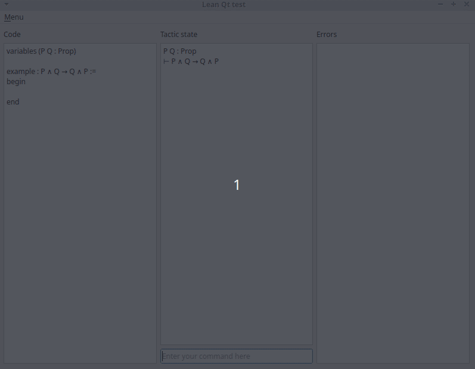

# Lean client for Python

This experimental package aims to help talking to the 
[Lean theorem prover](http://leanprover.github.io/) from Python.

You can install it by cloning this repository and running 
`pip install path_to_your_clone`. 

## Core interface

The core piece is the `lean_client.commands` module which bridges from JSON
messages produced and consumed by `lean --server` to python objects.
This core does not help at all with handling interactivity, in
particular the fact that Lean processes things in parallel and answer
somewhat impredictably (depending on the presence of errors, or simply
on elaboration and proof checking time). Interactivity can be handled
only in an asynchronous environment. We provide (very partial) support
for two such environments with very different patterns. 

## Qt interface

The module `lean_client.qt_server` defines a `QtLeanServer` class which
allows communication with Lean from a Qt event loop. 
Qt handles asynchronicity using 
[signals and slots](https://doc.qt.io/qt-5/signalsandslots.html), hence
this example can be adapted to any framework based on call-backs.
It requires `PyQt5` (and its C++ dependencies) that you can install
using `pip install path_to_your_clone[qt]`. See the example program
`qt_interface` in the `examples` folder of this repository. This example
opens a Qt windows which asks for a sequence of instruction proving a
simple lemma (you can go back using Ctrl-Z and quit using Ctrl-Q).  The
following animated Gif shows it in action.

## Trio/asyncio interface

The module `lean_client.trio_server` defines a `TrioLeanServer` class which
allows communication with Lean from a
[Trio](https://trio.readthedocs.io/en/stable/) nursery. This framework
is built on top of python's
[asyncio](https://docs.python.org/fr/3/library/asyncio.html), hence can
be adapted to any framework based on async/await.
It requires `trio` which you can install using `pip install
path_to_your_clone[trio]`. See the example program `trio_example` in the
`examples` folder of this repository. This example displays the tactic state for
every line of `examples/test.lean` that has a non-empty tactic state.

You can install all optional dependencies at once using 
`pip install path_to_your_clone[all]`.
